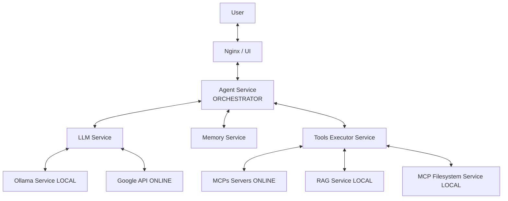
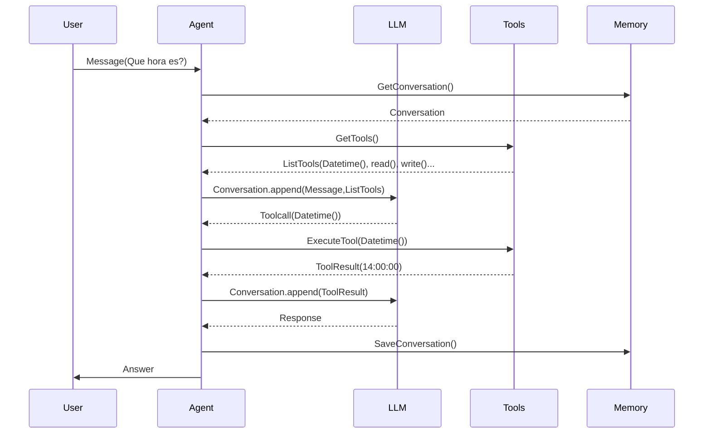

# Chatbot Agent + tools + MCP + RAG
Este proyecto ejecuta un agente distribuido en microservicios, diseñado para ser modular, escalable y portable a distintos proveedores de IA, bdd y herramientas.


## Visión general
El proyecto está distribuido y por capas para no acoplarse. Los servicios se comunican con contratos compartidos en `shared/` y validados por `pydantic`.

- **Agent:** coordina el flujo e informa al frontend en tiempo real mediante WebSockets.
- **LLM:** integra proveedores de modelos de lenguaje, como Ollama en local o Google Gemini.
- **Memory:** recupera y guarda el historial de conversación. Actualmente, el almacenamiento es en memoria.
- **Tools Executor:** ejecuta herramientas locales y herramientas descubiertas en servidores MCP.
- **Nginx:** sirve el frontend y enruta las conexiones WebSocket y las peticiones HTTP correspondientes.
- **RAG:** procesa documentos y permite buscar información en ellos.

Puedes cambiar, manteniendo los contratos entre servicios:

- el almacenamiento de las conversaciones;
- el proveedor o el modelo de IA;
- la capa de presentación;
- la implementación de la búsqueda documental (RAG).

Puedes extender:

- el conjunto de herramientas locales;
- los servidores MCP conectados.


## Arquitectura general



Ej. el agente responde que hora es:
---


## Requisitos previos

Antes de iniciar el proyecto, asegúrate de tener instalado:

- Docker
- Docker Compose v2
- Make
- Git

### Proveedor de IA

Por defecto, el proyecto usa Ollama con el modelo local `qwen2.5:3b`. Para elegir otro modelo local, define `OLLAMA_MODEL` en el archivo `.env` de la raíz. Ollama descargará el modelo si todavia no esta disponible. Se recomienda definir google gemini para levantar mas rapido el proyecto.
| Variable | Uso | Valor|
|---|---|---|
| `LLM_PROVIDER` | Proveedor del modelo | `ollama` |
| `OLLAMA_MODEL` | Modelo local usado por Ollama. | `qwen2.5:3b` |

Como alternativa, puedes usar Google Gemini. Configura tu clave de API en `.env`.Al usar Gemini no levanta ni descarga Ollama y su modelo por defecto.

| Variable | Uso | Valor|
|---|---|---|
| `LLM_PROVIDER` | Proveedor del modelo | `google` |
| `GOOGLE_API_KEY` | Clave necesaria para usar Google Gemini. | tu api key |
| `GOOGLE_MODEL` | Modelo de Google Gemini. | `gemini-2.5-flash` |

## Ejecutar

```bash
git clone https://github.com/vcereced/chatbot-agent-MCP-RAG.git
cd chatbot-agent-MCP-RAG
make up
```
Despues abre en el navegador: 
```bash
http://localhost:8080
``` 
Para detener los servicios, ejecuta `make down` o `docker compose down`.

## Testing
Los tests de `tests/` se ejecutan con Pytest. `make test` levanta los servicios necesarios excepto Ollama y usa `fake-llm` para simular respuestas del proveedor de IA de forma determinista. No necesitas iniciar Ollama ni configurar una clave de Google.

Ejecuta desde la raíz:

```bash
make test
```
El comando muestra `TESTS PASSED` o `TESTS FAILED`. Para ver la salida detallada de Pytest, ejecuta:
```bash
make test-verbose
```
`make test` también puede usarse en un workflow de CI para validar los cambios automáticamente.

## Tecnologías utilizadas

| Categoría | Tecnologías |
|---|---|
| Backend | Python 3.x, FastAPI, Uvicorn, WebSockets, Pydantic, Pydantic Settings,HTTPX  |
| IA y llm | Ollama, Google GenAI, MCP |
| RAG | ChromaDB, PyMuPDF, Sentence Transformers |
| Infraestructura | Docker, Docker Compose, Nginx |
| Testing | Pytest, pytest-asyncio |


## Desarrollo y extensión

### Añadir un nuevo microservicio

Se recomienda mantener la misma estructura base:

```text
nuevo_servicio/
├── requirements.txt
│   Dockerfile
├── app/
│   ├── main.py
│   ├── config.py
│   ├── api/
│   ├── service/
│   ├── clients/
│   └── domain/
```

### Añadir una herramienta local

1. Crea un archivo en `tools-executor/app/tools/` e implementa la herramienta como una subclase de `BaseTool`. Debe definir:
   - `get_definition()`, que devuelve su nombre, descripción y esquema de argumentos.
   - `execute(arguments)`, que ejecuta la herramienta de forma asíncrona.

2. Importa la nueva clase en `tools-executor/app/main.py` y regístrala dentro del bloque `# Local tools` de `lifespan`:

   ```python
   from app.tools.nueva_herramienta import NuevaTool

   # Local tools
   registry = ToolRegistry()
   registry.register(CalculatorTool())
   registry.register(DateTimeTool())
   registry.register(RAGSearchTool())
   registry.register(NuevaTool())

### Añadir y Conectar un servidor MCP

El proyecto puede conectarse a servidores MCP locales o online, siempre que sean compatibles con el transporte MCP Streamable HTTP (no stdio) y que el servicio `tools-executor` pueda acceder a ellos.

1. **Servidor local en Docker Compose:** añade el servicio MCP a docker-compose.yml y añadirlo en `depends_on` de `tools-executor`.

2. Añade una entrada a `mcp_servers` dentro de Settings en [tools-executor/app/config.py](../tools-executor/app/config.py):

   ```python
   MCPConfig(
       name="nombre_mcp_server",
       url="http://mcp-nuevo-servicio:8000/mcp",
   ),
   MCPConfig(
       name="otro_MCP_server",
       url="http://mcp-nuevo-servicio2:8000/mcp",
   ),
   ```
3. Configura la URL según dónde se ejecute el servidor:
   - En Docker Compose, usa el nombre del servicio, por ejemplo `http://mcp-github:8000/mcp`.
   - Para un servidor online, usa su endpoint MCP público.

Después de configurar el servidor, levanta los servicios:

```bash
docker compose up --build 
```

Al iniciar, `tools-executor` se conecta a los servidores configurados locales y online y descubre sus herramientas para ofrecerlas al agente. Si el servidor online requiere autenticacion no conectara.

