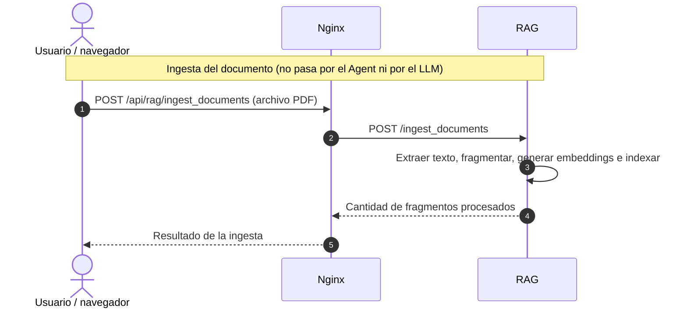
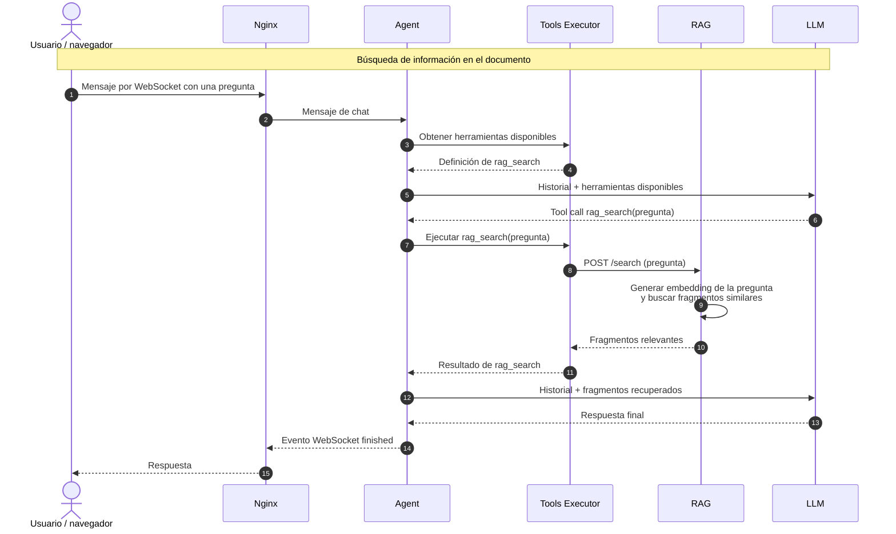

-## RAG
## RAG
# API del proyecto

Esta página documenta las interfaces HTTP y WebSocket del sistema y cómo se comunican sus servicios.

## Acceso y red

El único puerto publicado en el host es `8080`, servido por Nginx (`http://localhost:8080`). Nginx sirve la interfaz web y enruta las peticiones a los servicios internos. Los nombres como `agent` o `llm` son DNS internos de Docker Compose; no son direcciones accesibles directamente desde el navegador o el host.

| Servicio | Dirección interna | Acceso desde el host |
|---|---|---|
| Nginx / interfaz | `http://nginx:80` | `http://localhost:8080` |
| Agent | `http://agent:8000` | No publicado |
| LLM | `http://llm:8000` | No publicado |
| Memory | `http://memory:8000` | No publicado |
| Tools Executor | `http://tools-executor:8000` | No publicado |
| RAG | `http://rag:8000` | No publicado; accesible mediante Nginx |
| Ollama | `http://ollama:11434` | No publicado |
| MCP Filesystem | `http://mcp-filesystem:8000` | No publicado |

Los servicios de prueba `fake-llm` y `test-runner` se usan durante el testing y no son puntos de acceso del producto.

## Health checks

Agent, LLM, Memory, Tools Executor, RAG, MCP Filesystem y Fake LLM exponen `GET /health`. Docker Compose consulta `/health` cada 60 segundos para actualizar el estado `healthy` del contenedor. `test-runner` usa:
```
depends_on:
  condition: service_healthy
```
Docker Compose espera a que sus dependencias estén saludables antes de ejecutar las pruebas. Ollama y Nginx no tienen configurado este healthcheck.


## Contratos compartidos

Los payloads de Agent, LLM, Memory Rag y Tools-Executor se validan con modelos Pydantic compartidos bajo `shared/`.

## Nginx / interfaz web

Nginx es la entrada pública del sistema. Sirve los archivos estáticos de la interfaz y enruta las peticiones; no implementa la lógica del agente.

| Ruta pública | Destino interno | Uso |
|---|---|---|
| `/` y rutas de la interfaz | Archivos estáticos de Nginx | Cargar el frontend. |
| `/ws` | `agent:8000/ws` | Sesión de chat en tiempo real mediante WebSocket. |
| `/api/rag/*` | `rag:8000/*` | Ingestar PDF y buscar en documentos. Nginx elimina el prefijo `/api/rag` al reenviar la ruta. |

La interfaz está disponible en `http://localhost:8080`.

El WebSocket del chat usa `ws://localhost:8080/ws`.

## Agent

El servicio `agent` orquesta la conversación y se comunica con el cliente mediante WebSocket:

```text
ws://localhost:8080/ws
```

### Mensajes del cliente al agente

Para iniciar una petición, el cliente envía `ChatRequest`. `conversation_id` puede ser `null` para iniciar una conversación o contener el ID de una existente:

```json
{
  "type": "message",
  "conversation_id": null,
  "message": "¿Qué hora es?"
}
```

Para cancelar una ejecución, envía un `ChatRequest` con su `run_id`:

```json
{
  "type": "cancel",
  "run_id": "id-de-la-ejecucion"
}
```

### Eventos del agente al cliente

El agente envía eventos WebSocket independientes. Todos incluyen `type` y `run_id`; los campos adicionales varían según el evento:

| `type` | Descripción |
|---|---|
| `started` | La ejecución ha comenzado; incluye `conversation_id` y `message`. |
| `status` | Actualización de estado; incluye `message`. |
| `finished` | La ejecución terminó; incluye `conversation_id` y la respuesta en `message`. |
| `cancelled` | La ejecución fue cancelada. |
| `error` | Se produjo un error; incluye `message`. |

Ejemplo de evento final:

```json
{
  "type": "finished",
  "run_id": "id-de-la-ejecucion",
  "conversation_id": "id-de-la-conversacion",
  "message": "Son las 14:00."
}
```

## Memory

El servicio `memory` crea, recupera y guarda conversaciones. Actualmente las mantiene en memoria del proceso, no en una base de datos persistente; por tanto, se pierden al reiniciar el servicio.

### `POST /conversations/get_or_create`

URL interna: `http://memory:8000/conversations/get_or_create`.

Recibe `GetOrCreateConversationRequest`. Si `conversation_id` identifica una conversación existente, la devuelve. Si es `null`, crea una conversación con un ID nuevo; si se proporciona un ID desconocido, crea una conversación con ese mismo ID.

```json
{
  "conversation_id": null
}
```

Devuelve `GetOrCreateConversationResponse`, que contiene una `Conversation` con `id` y `messages`:

```json
{
  "conversation": {
    "id": "id-de-la-conversacion",
    "messages": []
  }
}
```

### `POST /conversations/save`

URL interna: `http://memory:8000/conversations/save`.

Recibe `SaveConversationRequest` con la conversación completa:

```json
{
  "conversation": {
    "id": "id-de-la-conversacion",
    "messages": [
      {"role": "user", "content": "Hola"},
      {"role": "assistant", "content": "¡Hola!"}
    ]
  }
}
```

Devuelve `SaveConversationResponse`:

```json
{
  "success": true
}
```

## LLM

El servicio `llm` recibe del agente el historial de mensajes y las definiciones opcionales de herramientas. Adapta la solicitud al proveedor configurado (Ollama o Google Gemini) y devuelve el resultado en el contrato común del proyecto.

### `POST /generate`

URL interna: `http://llm:8000/generate`.

#### Solicitud

- El servicio recibe un `GenerateRequest` con `messages`: historial de la conversación. Cada mensaje tiene un `role` (`system`, `user`, `assistant` o `tool`).
- `tools`: lista de herramientas que el modelo puede invocar, con su descripción y esquema de entrada. Puede ser `null` si no se ofrecen herramientas.

```json
{
  "messages": [
    {
      "role": "user",
      "content": "¿Cuánto es 25 * 4?"
    }
  ],
  "tools": [
    {
      "name": "datetime",
      "description": "Devuelve la fecha y hora actuales.",
      "input_schema": {
        "type": "object",
        "properties": {},
        "required": []
      }
    },
    {
      "name": "calculator",
      "description": "Realiza operaciones matemáticas.",
      "input_schema": {
        "type": "object",
        "properties": {
          "expression": {
            "type": "string",
            "description": "Expresión matemática a calcular, por ejemplo: 25 * 4"
          }
        },
        "required": [
          "expression"
        ]
      }
    }
  ]
}
```

#### Respuesta

`GenerateResponse` contiene `result`. El proveedor puede devolver texto final o una llamada a herramienta. Si devuelve `tool_call`, el agente ejecuta la herramienta y vuelve a llamar a `llm` con el historial actualizado.

Respuesta con llamada a herramienta:

```json
{
  "result": {
    "text": null,
    "tool_call": {
      "name": "datetime",
      "arguments": {}
    }
  }
}
```

Respuesta con texto:

```json
{
  "result": {
    "text": "Son las 14:00.",
    "tool_call": null
  }
}
```

## Tools Executor

`tools-executor` hace de catálogo y ejecutor de herramientas para el agente. Al iniciar, combina las herramientas locales registradas con las que descubre en los servidores MCP configurados. Al ejecutar una llamada, la dirige a la herramienta local correspondiente o al cliente MCP que la publicó. Las ejecuciones tienen un tiempo límite.

### `GET /tools`

URL interna: `http://tools-executor:8000/tools`.

Devuelve `ListToolsResponse`, con una lista de `ToolDefinition`. Cada definición incluye el nombre, descripción y esquema de entrada de una herramienta:

```json
{
  "tools": [
    {
      "name": "datetime",
      "description": "Returns the current date and time.",
      "input_schema": {
        "type": "object",
        "properties": {},
        "required": []
      }
    }
  ]
}
```

### `POST /execute`

URL interna: `http://tools-executor:8000/execute`.

Recibe `ExecuteToolRequest`, que contiene un `ToolCall` con el nombre de la herramienta y sus argumentos:

```json
{
  "tool_call": {
    "name": "calculator",
    "arguments": {
      "expression": "2 + 2"
    }
  }
}
```

Devuelve `ExecuteToolResponse`, cuyo `tool_result` incluye el nombre, si tuvo éxito, el resultado o el error, y el tiempo de ejecución en milisegundos:

```json
{
  "tool_result": {
    "tool_name": "calculator",
    "success": true,
    "result": 4,
    "error": null,
    "execution_time_ms": 12.5
  }
}
```

Si la herramienta no se encuentra, falla o supera el tiempo límite, `success` es `false` y `error` describe el problema.

## RAG
El servicio `rag` ofrece dos operaciones: **ingestión de PDF** y **búsqueda semántica** sobre los documentos ingeridos. El frontend sube el archivo directamente a RAG y, más tarde, el agente puede pedir fragmentos relevantes mediante la herramienta local `rag_search` dentro de `tools-executor`.

### Ingesta
En la ingesta recibe el archivo directamente desde el navegador, extrae el texto página por página, lo divide en fragmentos, genera un embedding para cada fragmento y los añade a ChromaDB.


### Búsqueda
En una búsqueda, el usuario hace una pregunta en el que `rag` genera un embedding de la pregunta y consulta ChromaDB para recuperar los fragmentos más próximos.

La herramienta local `rag_search`, registrada en `tools-executor`, actúa como cliente del endpoint de búsqueda de RAG. Cuando el LLM decide invocarla, `tools-executor` reenvía la pregunta a RAG y devuelve los fragmentos al agente, que los incorpora al contexto antes de volver a llamar al LLM.



Este diseño evita transmitir archivos PDF o documentos completos al LLM. En su lugar, el LLM recibe solo los fragmentos que RAG recupera para la pregunta actual.

Dado la creciente responsabilidad de negocio de `rag` se decidio ser un servicio independiente al margen de `tools-executor`
La configuración actual utiliza un cliente Chroma en memoria; por tanto, los documentos indexados no sobreviven al reinicio del servicio.


### `POST /ingest_documents`

URL externa: `http://rag:8000/api/rag/ingest_documents`.
URL interna: `http://rag:8000/ingest_documents`.

Envía un archivo PDF como `multipart/form-data`, usando el campo `file`. La respuesta indica cuántos fragmentos se añadieron al índice:

```json
{
  "chunks": 8
}
```

Nginx limita el tamaño del archivo subido a 20 MB.

### `POST /search`

URL interna: `http://rag:8000/search`.

Recibe `SearchRequest`: `question` es obligatoria y `limit` determina el número máximo de resultados (por defecto, `5`). Una pregunta vacía devuelve HTTP 400.

```json
{
  "question": "¿Qué información contiene el documento sobre el proyecto?",
  "limit": 3
}
```

La respuesta contiene una lista `results`. Cada resultado incluye el identificador del fragmento y documento, número de fragmento y página, texto extraído y la distancia devuelta por Chroma en `score` (no es una probabilidad):

```json
{
  "results": [
    {
      "id": "documento-id_0",
      "document_id": "documento-id",
      "chunk_id": 0,
      "page": 1,
      "text": "Fragmento de texto recuperado...",
      "score": 0.23
    }
  ]
}
```

## Test Runner

`test-runner` no es un servidor ni expone una API HTTP. Es un contenedor efímero que monta los archivos de `tests/` en `/tests` y ejecuta Pytest. `make test` y `make test-verbose` levantan primero las dependencias de prueba y luego ejecutan `docker compose run --rm test-runner`; Compose espera a que los servicios declarados con `condition: service_healthy` estén saludables antes de lanzar los tests. `make test` presenta un resumen del resultado; `make test-verbose` imprime el detalle de Pytest.

## Fake LLM

`fake-llm` es un proveedor simulado, exclusivo del entorno de pruebas. Implementa el formato de chat de Ollama en `POST /api/chat` y responde de forma determinista a los casos definidos en el código de pruebas. Así, la suite no necesita consultar Ollama ni Google Gemini.

### `POST /api/chat`

URL interna: `http://fake-llm:8000/api/chat`. Durante los tests, el servicio `llm` usa esta dirección como base de Ollama y conserva `/api/chat` como endpoint.

Recibe `model`, `messages`, `stream` y `tools`, siguiendo el esquema de chat de Ollama. Por ejemplo, el texto de usuario `test mensaje` produce una respuesta simulada `test mensaje ok`; las pruebas de herramientas incluyen un caso que solicita `calculator` con `expression: "2 + 2"`. No es un endpoint para uso en producción.

## Ollama

Ollama es el proveedor local opcional de modelos. El servicio `llm` lo llama por la red interna de Compose; su puerto no se publica en el host. Al arrancar, el contenedor inicia Ollama y descarga el valor configurado en `OLLAMA_MODEL` si todavía no está disponible.

### `POST /api/chat`

URL interna: `http://ollama:11434/api/chat`.

El servicio `llm` envía el modelo, el historial, las herramientas disponibles y `stream: false`. Ollama responde con texto o una llamada a herramienta; `llm` convierte la respuesta a `GenerateResponse`. Para la aplicación, utiliza `POST /generate` de `llm`; este endpoint de Ollama es una dependencia interna.

Ejemplo simplificado de solicitud:

```json
{
  "model": "qwen2.5:3b",
  "messages": [
    {"role": "user", "content": "Hola"}
  ],
  "stream": false,
  "tools": []
}
```

## MCP Filesystem

`mcp-filesystem` es un servidor MCP local que publica operaciones de lectura de archivos y listado de directorios mediante **MCP Streamable HTTP**. Su endpoint, accesible desde la red de Compose, es `http://mcp-filesystem:8000/mcp`. No ofrece una API REST convencional para cada herramienta: `tools-executor` establece una sesión MCP, descubre las herramientas al iniciar y las expone al agente mediante `GET /tools` y `POST /execute`.

| Herramienta MCP | Argumentos | Comportamiento |
|---|---|---|
| `list_directory` | `path` opcional; por defecto `.` | Devuelve los nombres de los elementos de un directorio. |
| `read_file` | `path` obligatorio | Devuelve el contenido de un archivo de texto. |

El contenedor monta `mcp-test-data` en `/projects`, que es la raíz permitida. `list_directory` usa `.` por defecto, y ambas herramientas solo aceptan rutas que resuelvan dentro de `/projects`; cualquier ruta fuera se rechaza.


